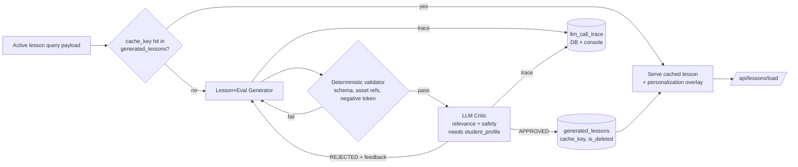

# LLM-Generated Lessons — Design Specification

Status: **Backend-first slice implemented** (schema, validator, generator,
critic, pipeline, trace, caching, and API routes — see `schema.sql`,
`db.py`, `llm_client.py`, `validator.py`, `generator.py`, `critic.py`,
`pipeline.py`, and the new routes in `main.py`). The registration UI and
`/admin/trace`/`/admin/lessons` views described below are **not yet
built** — student/lesson-request creation happens via
`POST /api/students` / `POST /api/lesson-requests` for now. Requires
`LLM_BASE_URL`/`LLM_API_KEY`/`LLM_MODEL` in the environment to actually
generate (untested against a real endpoint in this environment — verified
via `tests/test_pipeline.py`'s fake-LLM-client tests, plus a live curl
walkthrough of the cache-hit path, request lifecycle, and failure
handling).

## 1. Motivation

Today's lesson content is fully static: `main.py` hardcodes every step's
`content_type`/`scene`/`evaluation` JSON, and the frontend engine
(`static/app.js` + `static/index.html`) renders whatever schema-conformant
JSON it's given. This spec extends that with a second, LLM-driven content
pipeline that generates lessons on the fly for `(skill, modality)`
combinations that don't have a hand-authored step — while keeping the
client-side contract identical: the frontend still only ever prefetches one
JSON payload and renders it through the existing generic engine. Generation
is an authoring-time backend concern, not a runtime one.

This design was shaped directly against a reference implementation at
`/Users/sumaygupta/Claude/Projects/LearningAvatar/agents` — a Streamlit UI
+ two Flask "agent" servers (tutor, critic) wired over hand-rolled
JSON-RPC. Several of its weaknesses are deliberately designed out here:

- Its "critic" did no LLM review at all — just a banned-substring check
  with a hardcoded pass/fail score. **Ours uses a real LLM critic with a
  structured, per-dimension rubric.**
- Its trace console was in-memory only and lost on restart. **Ours
  persists every LLM call to SQL, in an OTEL-span-shaped record, from day
  one.**
- It collected a student personalization profile in the UI and then never
  actually passed it to the generator (a dead parameter). **Ours threads
  `student_profile` through generation and through the safety-critique
  step explicitly.**
- Its retry loop ran synchronously in the request path. **Ours generates
  offline as a background job; the student-facing prefetch stays instant
  either way.**

## 2. Two content pipelines, one schema, one renderer

Routing rule: at request time, look up `(skill, modality)` in the static
curriculum. If a hand-authored step exists, serve it as-is — full
`content_type: "interactive_scene"` with `controls`/`behaviors`/`objects`
allowed, since a human author validated it. If not, fall through to the
generation pipeline described below.

**Generated lessons are restricted to `content_type: "slideshow"` or
`"story"` — never `"interactive_scene"`.** This is the concrete rule behind
"pre-generated lessons get the rich interactive UI, generated lessons get
the simpler UI": it scopes the highest-risk surface (the `scene.behaviors`
whitelisted rule DSL, and `scene.controls`/`objects` graph) out of LLM
authorship entirely, rather than trying to make an LLM reliably emit valid
rule expressions. Background images are chosen from the existing
`asset_manifest` whitelist — the LLM never invents an image URL.

Either path produces the exact same step shape our frontend already
renders. This is non-negotiable: it's what keeps this additive rather than
a fork of the UI.

## 3. Inputs and registration

Collected once at student registration, stored in SQL (not re-entered per
lesson):

- `skill`, `modality`, `mastery_pct`, `prereq_threshold`
- `negative_constraint_token` (a hard content constraint, checked
  deterministically before any LLM critique)
- `student_profile`: favorite sport/game, favorite character, friend
  names, age/grade
- The current in-flight generation request is itself persisted as an
  "active lesson query payload" row (`lesson_requests`), not just held in
  UI state — so a request is resumable/auditable, not lost on refresh.

## 4. Generation pipeline



**Roles: 3, not 4.** Lesson-plan generation and evaluation generation are
combined into a single generator call (the evaluation question naturally
follows from the scenario a human author would also write both at once);
a single LLM critic reviews plan + evaluation together. If per-artifact
independent regeneration turns out to be needed later, this can be split
back into 4 roles without changing the schema.

**Deterministic validation runs before any LLM critique call** — schema
conformance, referenced `asset_manifest` ids exist, referenced control ids
in `behaviors` exist in `controls` (N/A for generated content today since
generated content has no `behaviors`, but the validator is shared code
with the pre-generated path), and `negative_constraint_token` absence.
Cheap, free, catches structural bugs without spending a model call.

**LLM critic rubric — content relevance + student-profile safety:**
- The critic prompt receives the draft **and** relevant `student_profile`
  fields (at minimum age/grade) — safety review is inherently personalized,
  not a generic content-only check.
- Output is structured, not a single score:
  `{relevance_score, safety_score, decision, feedback}` — this is the
  direct fix for the reference implementation's hardcoded-score critic.
  `critic_feedback` in `generated_lessons` should always explain *why* on
  each axis, not just pass/fail.
- Caveat carried forward from the design discussion, not a blocker: an
  LLM-as-judge is a reasonable safety layer for a prototype, but is not a
  substitute for a dedicated content-moderation classifier if this ever
  serves real students in production.

**Timing:** generation runs as a background job (FastAPI `BackgroundTasks`
is sufficient at this scale — no queue infra needed), with
`lesson_requests.status` moving `pending → generating → ready|failed`.
`/api/lessons/load` only ever serves `ready` lessons. The client-side
prefetch contract is unchanged — one instant call, zero-lag interaction
after that — regardless of whether the served content was hand-authored or
generated.

## 5. Caching — the one real product tradeoff

Personalization and caching pull in opposite directions: a cache key that
includes per-student personalization almost never hits across students; a
cache key that excludes it makes "personalized" content generic.

**Decision:** `cache_key = (skill, modality, negative_constraint_token)` —
i.e., cache on what actually constrains *content*, not on personalization.
Personalization is applied as a cheap post-process on top of cached
generic content:
- Character/skin selection is already free and client-side (the existing
  `character_library` picker) — no regeneration needed.
- Sport/friend-name references are applied via simple template
  substitution (e.g. `{{favorite_sport}}`) into the cached generated text,
  rather than being baked into the generation prompt per student.

If deeper per-student personalization in the LLM's own phrasing is
actually wanted later, the cache key would need a `student_profile_hash`
component — but that mostly defeats the reuse goal this was built for, so
it's deliberately excluded unless explicitly revisited.

Race handling: a unique constraint on `cache_key` means two simultaneous
cache-miss requests just resolve to one canonical row (the second insert
fails/reselects) — no distributed lock needed at this scale.

## 6. Tracing / observability

Every LLM call (generator, critic) goes through one `record_llm_call(...)`
chokepoint that does two things:
1. `INSERT` into `llm_call_trace`.
2. `logger.info()` a structured JSON line to the server console.

The table is shaped close to OpenInference/OTEL span conventions **now**,
even without the SDK, so adopting real OTEL + Arize Phoenix later is
additive (start also emitting real spans) rather than a schema rewrite:

```
llm_call_trace(id, trace_id, span_id, parent_span_id, request_id,
                role,            -- 'lesson_generator' | 'lesson_critic'
                model, input, output, status,
                started_at, ended_at, latency_ms)
```

Search: SQLite FTS5 over `input`/`output` gives real text search without
adding an external service — deferred until Phoenix is actually wired up,
at which point search likely moves to Phoenix itself.

The trace view is a separate `/admin/trace` surface, not embedded in the
student-facing Socratic Panel — a debugging/observability tool should not
bleed into the product UI a student sees.

## 7. Data model (SQLite)

```
students(id, name, age, grade, favorite_sport, favorite_character,
         friend_names, created_at)

lesson_requests(id, student_id, skill, modality, mastery_pct,
                 prereq_threshold, negative_constraint_token,
                 status,          -- pending | generating | ready | failed
                 created_at)

generated_lessons(id, cache_key, skill, modality, negative_constraint_token,
                   step_index, content_type, payload_json,
                   critic_status, critic_feedback, attempt_count,
                   hit_count, last_used_at,
                   is_deleted, deleted_at, created_at)

llm_call_trace(id, trace_id, span_id, parent_span_id, request_id,
                role, model, input, output, status,
                started_at, ended_at, latency_ms)
```

`generated_lessons` is a cache, not a log — `hit_count`/`last_used_at`
track reuse; `is_deleted`/`deleted_at` support future select-and-delete
admin tooling **as a soft delete by default**. A genuinely destructive
hard-delete can be added later as a separate, rarer admin action; soft
delete keeps `llm_call_trace` rows (referenced by `request_id`, not the
lesson row) valid as an audit trail even after a lesson is retired from
circulation.

## 8. Explicit decisions carried into this spec (flag if any should change)

- Cache key excludes student-specific personalization; personalization is
  a post-process overlay, not part of the generation prompt's identity.
- 3 generation roles (combined plan+eval generator, one combined critic),
  not 4 independent ones.
- SQLite, not Postgres — matches the project's no-external-services
  philosophy; revisit only if multi-instance/concurrent-write needs arise.
- Generation is an offline background job; the frontend's one-shot
  prefetch contract is preserved unchanged.
- Trace schema is OTEL-shaped starting now, but the actual
  `opentelemetry-sdk` / Arize Phoenix dependency is deferred until that
  integration is actually being built.
- Delete is soft by default.

## 9. Not yet implemented

This document describes the approved design only. No migrations, FastAPI
routes, or generation code exist yet. Next step when ready: turn this into
an implementation plan (SQL migrations, the `record_llm_call` wrapper, the
cache-check branch in the request flow, the generator/critic prompt
templates, the `/admin` surfaces).
