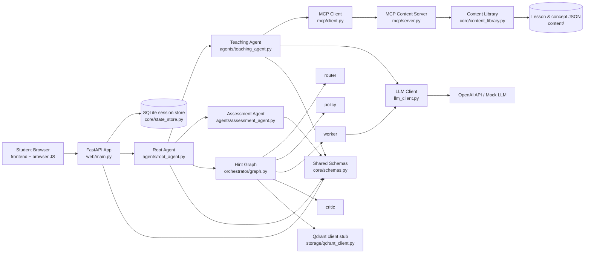
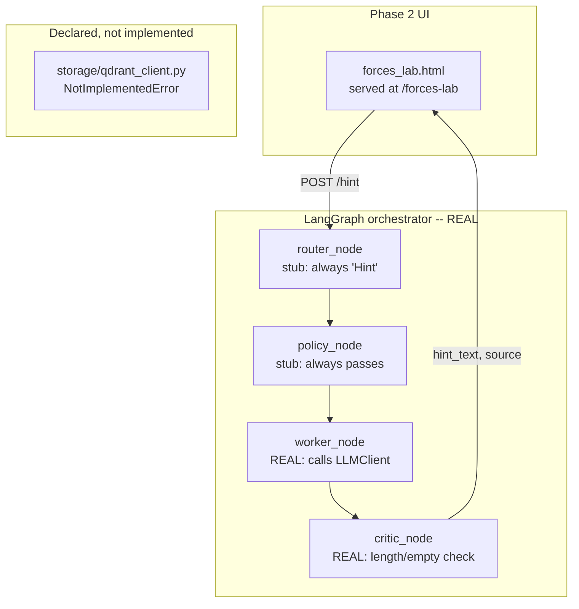

# Architecture

## Current implementation architecture



This view captures the current implementation shape: the browser talks to FastAPI, the root agent coordinates teaching and assessment, the teaching agent prefers MCP-backed content before falling back to the LLM client, and the hint path runs through a small LangGraph orchestrator.

```
Browser (adaptive_learning_avatar_demo_v4.html)
   │  fetch("/api/...")  — same origin, no CORS
   ▼
FastAPI app (src/learning_avatar/web/main.py)
   │  owns nothing but HTTP <-> Python translation
   ▼
Root Agent (src/learning_avatar/agents/root_agent.py)
   │  orchestration + critic check + session state (core/state_store.py)
   ▼
Teaching Agent (src/learning_avatar/agents/teaching_agent.py)
   │
   ├── 1. MCP call ──▶ mcp/client.py ──[HTTP]──▶ mcp/server.py ──▶ core/content_library.py ──▶ content/*.json
   │                    (fast, free, pre-vetted — checked first;
   │                     raises MCPServerUnavailableError if that process isn't running)
   │
   └── 2. LLM fallback ──▶ llm_client.py ──▶ OpenAI API (or MockLLMClient)
                            (only when step 1 finds nothing)
```

Assessment Agent (`agents/assessment_agent.py`) sits alongside Teaching
Agent, called by Root Agent the same way, for standalone checkpoint
quizzes rather than full lessons.

## Two processes, started in order

This system is deliberately two separate OS processes, not one:

1. **The content server** (`uv run learning-avatar-mcp-server`) — long-running,
   started by hand, first. It's a backing service, the same way a database
   would be: nothing spawns it automatically, and nothing kills it when a
   request finishes.
2. **The web app** (`uv run learning-avatar-serve`) — started second. Its
   `mcp/client.py` connects to the content server over HTTP
   (`http://127.0.0.1:9000/mcp` by default, see `config.yaml`'s `mcp:`
   section) for every lesson lookup.

If process 2 tries to reach process 1 and nothing's listening, `mcp/client.py`
raises `MCPServerUnavailableError`. `web/main.py`'s `/lesson` route turns
that into an HTTP 503 with a message telling you exactly which command to
run. The frontend's existing error-card path (built for any failed lesson
fetch) displays it directly to the student — no silent hang, no auto-launch
of a hidden process.

This replaced an earlier version where `mcp/client.py` spawned `server.py`
as a subprocess over stdio on every single call. That worked, but made the
system harder to reason about (one process quietly launching another,
per request) for no benefit in a project this size — the two-terminal,
start-it-yourself model is the same shape you'd use with any real backing
service, and failures are visible instead of implicit.

## Phase 2: LangGraph orchestrator (one real slice) + stubs for the rest

Added on top of everything above, without changing any of it. Maps onto the
"AI-Driven Adaptive Multi-Agent Learning Platform" plan doc's 6-layer
architecture, scoped honestly:



- **Real:** `orchestrator/graph.py` is an actually-compiled
  `langgraph.graph.StateGraph`. `worker_node` calls `labmodel/worker.py`,
  which calls the same `LLMClient` interface (mock or OpenAI) every other
  route already uses. `critic_node` calls `labmodel/critic.py` and rejects
  empty or oversized output, falling back to the frontend's static hint.
- **Stub, on purpose, not by accident:** `router_node` and `policy_node`
  always return the same fixed verdict — there's only one intent
  (`Hint`) flowing through this graph so far, so there's nothing to route
  or gate yet. `storage/qdrant_client.py` raises `NotImplementedError` on
  every call and is not wired into any request path.
- **Not touched:** Root/Teaching/Assessment agents, the MCP content server,
  and `adaptive_learning_avatar_demo_v4.html` are all exactly as they were
  in Phase 1. The plan doc's Router/Policy/Self-RAG/CRAG/GraphRAG-Lite/
  Auditor nodes, Google ADK layer, DSPy compilation, and GRPO/RLVR
  fine-tuning are **not represented anywhere in this codebase yet** —
  scaffolding those honestly (with the same "stub with a TODO, don't fake
  it" discipline as `storage/qdrant_client.py`) is future work.

## Why this shape

- **Root Agent never touches content.** It only decides *whether* to call
  a sub-agent and *whether* the result is good enough to show a student.
  All physics/pedagogy lives in Teaching Agent and its prompt file.
- **MCP is a real protocol boundary, not a Python import.** `mcp/server.py`
  runs as its own long-lived process, reached over HTTP. `teaching_agent.py`
  reaches it only through `mcp/client.py` — swapping the content source
  later (a database, a different team's MCP server) means changing
  `client.py`, nothing else.
- **The LLM is a last resort, not the default.** 12 lesson combinations are
  pre-authored and served for $0 before any model call happens. This is
  the main cost-control lever in the whole system.
- **One schema (`core/schemas.py`) is shared by everyone** — FastAPI
  validates against it at the HTTP boundary, agents validate against it
  before returning, and the frontend's JavaScript objects are shaped to
  match it. A malformed lesson can't silently reach a student.
